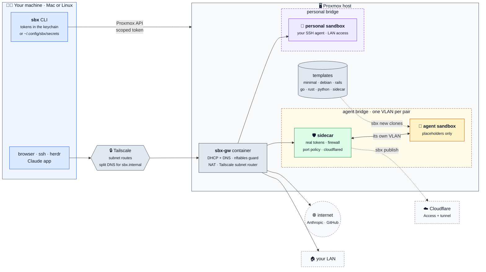

# sbx

`sbx` makes a throwaway Proxmox VM for development. The VM is a sandbox for an
agent with full permissions, or a clean machine for your own work.

```
sbx new myapp --project ~/code/some-app --with rails-master-key
open https://sbx-myapp.sbx.internal:3000
sbx rm myapp
```

Every sandbox appears in your herdr sidebar as it comes up, beside Local and
the other sandboxes, and leaves it when it is removed.

## Start here

You need a Proxmox host, a Mac or a Linux machine, and a Tailscale tailnet where
you are an admin. Everything is yours: nothing connects to a different person's
host.

```
git clone <this repository> && cd sbx
ln -s "$PWD/bin/sbx" "$(brew --prefix 2>/dev/null || echo /usr/local)/bin/sbx"
sbx setup                  # reads your host, writes host/local.conf, runs each setup step
sbx doctor --isolation     # proves the setup, with one probe sandbox per profile
```

[docs/getting-started.md](docs/getting-started.md) goes on from there, step by
step with a check each: an agent sandbox of your project with Claude Code
Remote Control, a preview of its app behind Cloudflare Access, and a sandbox
that lasts and comes back after a reboot. [docs/setup.md](docs/setup.md) has
the details of the setup and the manual path.

## How it fits together



Your machine talks to Proxmox through a scoped API token, and to the
sandboxes through Tailscale. The gateway container gives every sandbox its
address and name, and its firewall keeps an agent sandbox off your LAN and
your tailnet. Each agent sandbox also gets a **sidecar**: a small trusted VM on
a network segment that only the two share, which holds the real tokens and
decides what crosses. [docs/architecture.md](docs/architecture.md) has the
mechanism, with more diagrams.

## What you get

- A new VM in a few minutes, a copy of one of your templates: one for Rails,
  one for Rust, one on Debian with mise, one of your own.
- A DNS name for each VM: `sbx-<name>.sbx.internal`. No record is written
  when you make a VM, and no record is removed when you destroy it.
- Each port is direct, with the same port number: `https://sbx-myapp.sbx.internal:4400`.
  A dev server needs no bind option.
- HTTPS with a certificate that your Mac trusts.
- Two profiles:
  - `agent`: no access to your LAN, your tailnet or another sandbox. Its
    sidecar holds its git and Claude tokens; the VM gets placeholders. Secrets
    go in only when you name them. A `clean` snapshot is made after setup. The
    VM expires.
  - `personal`: LAN access, SSH agent forward for git, no expiry.
- Previews of an agent sandbox's app at a public hostname, behind Cloudflare
  Access (`sbx publish`).
- Claude Code Remote Control in a sandbox, and sandboxes that start with the
  host and resume their Claude sessions (`sbx autostart`).
- One recipe for each project, kept in that project's repository.

## The parts

| Directory | Runs on | Purpose |
|---|---|---|
| `bin/sbx`, `sbxlib/` | your Mac | the command line tool |
| `host/` | the Proxmox host | makes the bridges, the gateway, the template, and the scoped API token. `host/local.conf` holds your values |
| `gw/` | the gateway container | dnsmasq, the nftables guard, Tailscale |
| `sidecar/` | the sidecar of each agent sandbox | the credential proxy, the port policy, the preview tunnel |
| `template/` | the template VMs | the core build, the components (`template/components/`), and the `sbx-mirror` service |
| `templates/` | your Mac and the host | the template definitions: one per kind of project |
| `tailscale/` | the Tailscale admin console | the policy that the design needs |
| `examples/` | a project repository | recipes and manifests to copy |
| `tests/` | your Mac (some need Docker) | unit tests and five behavior tests |

## Documents

| Read | When you want to |
|---|---|
| [docs/getting-started.md](docs/getting-started.md) | go from nothing to an agent sandbox with Remote Control, a preview, and no expiry, step by step |
| [docs/setup.md](docs/setup.md) | set up sbx on your own host and Mac |
| [docs/usage.md](docs/usage.md) | make, reach and remove sandboxes each day |
| [docs/projects.md](docs/projects.md) | give a project its recipe, inputs and pane layout |
| [docs/templates.md](docs/templates.md) | have one template for each kind of project, and make your own |
| [docs/security.md](docs/security.md) | know what an agent in a sandbox can and cannot reach |
| [docs/troubleshooting.md](docs/troubleshooting.md) | fix a problem that `sbx doctor` does not explain |
| [docs/reference.md](docs/reference.md) | look up a command, a setting or a file |
| [docs/architecture.md](docs/architecture.md) | understand or change how sbx works |
| [docs/sidecar-rollout.md](docs/sidecar-rollout.md) | see what the sidecar design proved on a real host, and what is next |
| [AGENTS.md](AGENTS.md) | let a coding agent help you set up or change sbx |

## Commands you use most

```
sbx                          the basic usage on one screen (also: sbx guide)
sbx new <name>               make a sandbox (--profile, --project, --with, ...)
sbx list                     every sandbox
sbx ssh <name>               a shell in it
sbx publish <name> <port>    a preview behind Cloudflare Access
sbx autostart <name>         start at host boot, resume its Claude sessions
sbx rm <name>                destroy it
sbx doctor                   check the setup
```

[docs/reference.md](docs/reference.md) lists every command and option.

## Tests

```
python3 -m unittest discover -s tests -t .   # unit tests, no dependencies
tests/run-guard-test.sh                      # the isolation rules (needs Docker)
tests/run-dns-test.sh                        # names from DHCP, with a real DHCP client (needs Docker)
tests/run-mirror-test.sh                     # the port mirror with a real Caddy (needs Docker)
tests/run-finish-test.sh                     # `30-template-build.sh --finish` with a fake qm and the real seal (needs Docker)
tests/run-sidecar-test.sh                    # the sidecar, its VLAN and its refusals, in network namespaces (needs Docker)
```

Run `tests/run-guard-test.sh` after each change to `gw/nftables.conf.tmpl`,
`tests/run-dns-test.sh` after each change to `gw/dnsmasq.conf.tmpl`, and
`tests/run-sidecar-test.sh` after each change under `sidecar/`.
