# Getting started

One sequence, from nothing to an **agent sandbox of your project** that you
drive from your phone with **Claude Code Remote Control**, that shows its app
at a **public preview behind Cloudflare Access**, and that **lasts**: no
expiry, and back up with its Claude sessions after a host reboot.

Each step has a check. Each links to the document that explains it; this
page repeats none of it.

```mermaid
flowchart LR
    a["<b>1–3 · set up</b><br/><small>prerequisites · sbx setup<br/>sbx doctor --isolation</small>"]
    b["<b>4–5 · tokens</b><br/><small>Claude · your project's<br/>git token</small>"]
    c["<b>6 · the sandbox</b><br/><small>an agent sandbox<br/>of your project</small>"]
    d["<b>7 · Remote Control</b><br/><small>claude.ai/code and<br/>the Claude app</small>"]
    e["<b>8–9 · a preview</b><br/><small>Cloudflare Access<br/>+ a tunnel to a port</small>"]
    f["<b>10 · make it last</b><br/><small>no expiry · start at boot<br/>resume · a snapshot</small>"]
    a --> b --> c --> d --> e --> f

    classDef once fill:#e2e8f0,stroke:#334155,color:#0f172a
    classDef box fill:#fef3c7,stroke:#b45309,color:#0f172a
    classDef keep fill:#dcfce7,stroke:#15803d,color:#0f172a
    class a,b once
    class c,d,e box
    class f keep
```



The examples use the host `192.168.1.10`, the project
`https://github.com/me/myapp` on the branch `main`, and the preview domain
`previews.example.com`. Put your own in their place.

## 1. What you need

- A Proxmox VE 8 or 9 host, with its root password.
- A Mac, or a Linux machine, with Python 3.11 or later, `ssh` and `scp`.
- Tailscale on that machine, signed in, and a tailnet where you are an admin.
- A Claude subscription (Pro or Max).
- For step 8: a Cloudflare account with a domain of its own for previews.

On Linux, read [A Linux machine instead of a Mac](setup.md#a-linux-machine-instead-of-a-mac)
first: one Tailscale setting differs.

Check: `python3 --version` prints 3.11 or later, and `tailscale status`
lists this machine.

## 2. Set up the host (30 to 50 minutes)

```
git clone <this repository> && cd sbx
ln -s "$PWD/bin/sbx" "$(brew --prefix 2>/dev/null || echo /usr/local)/bin/sbx"
sbx setup --host 192.168.1.10
```

Run it in your own terminal: it asks for the root password once, and it stops
at the Tailscale steps. Say yes to the bridges, pick the templates you need,
and say yes to the `sidecar` template: every agent sandbox needs it.
[setup.md](setup.md) explains each step.

Check: `sbx doctor` ends with `0 failed`.

## 3. Prove the isolation

```
sbx doctor --isolation
```

It makes one sandbox of each profile, probes what each can reach, and
removes them (a few minutes). [security.md](security.md) shows what the
probes prove.

Check: every probe row is `ok`, among them `agent cannot reach the LAN` and
`agent cannot reach this Mac on the tailnet`.

## 4. The Claude token

```
sbx claude-token
```

It runs `claude setup-token`, which opens the browser; paste the token it
prints at the hidden prompt. An agent sandbox keeps it in its sidecar and gets
a placeholder. [usage.md](usage.md#claude-code) has the rest.

Check: `sbx claude-token --status` shows a token and its expiry.

## 5. Your project's git token

Make a fine-grained GitHub token for your repository only, with
**Contents: Read** (or **Read and write**, for the agent to push). Then:

```
sbx git-token https://github.com/me/myapp
```

Paste it at the hidden prompt. No checkout on your machine is needed. The
token stays on your machine and in the sandbox's sidecar, never in the
sandbox. [projects.md](projects.md#one-git-token-per-project) explains the
token, and how a project declares its recipe.

Check: the command prints `ok` for the repository, and `sbx projects` lists
`myapp` with a token.

## 6. The agent sandbox

```
sbx new myapp --project https://github.com/me/myapp --branch main --ttl 0
```

- `--ttl 0`: no expiry (step 10 explains the rest of "lasting").
- `--cores 2 --memory 16384` sizes it; `--template <name>` picks a template
  ([templates.md](templates.md)).
- A recipe with inputs needs `--with <input>` or `--without <input>` for each;
  `sbx inputs https://github.com/me/myapp` lists them and makes nothing.

It makes the sidecar, then the sandbox, clones the branch through the
sidecar, runs the recipe, and takes a `clean` snapshot. It takes a few
minutes.

Check: `sbx list` shows `sbx-myapp` running, with `-` under EXPIRES, and
`sbx ssh myapp -- git -C code/myapp status -sb` shows the branch.

## 7. Claude Code Remote Control

```
sbx remote-control myapp --allow-agent
```

**Read this first.** Remote Control needs a full claude.ai sign-in. In an
agent sandbox it lives in the VM, where the agent can read it, and it can
make API keys on your organization. `--allow-agent` is your decision to
accept that, for this sandbox only; the command warns each time.
[security.md](security.md) has the details.

The command prints a sign-in link. Open it, click **Authorize**, and paste
the code that the page shows. The server then runs as a service in
`~/code/myapp`.

Check: `sbx remote-control myapp --status` says `active`, and
`sbx-myapp · myapp` appears at <https://claude.ai/code> and in the Claude
app, signed in as the same account that you authorized.

## 8. Cloudflare, once

In the Cloudflare dashboard:

1. Add the domain `previews.example.com` to the account (or buy one there).
   Use a domain of its own: an agent serves what it wants on it.
2. Zero Trust: turn it on, and add the **One-time PIN** login method.
3. An API token with Account **Cloudflare Tunnel: Edit** and **Access: Apps
   and Policies: Edit**, and Zone **DNS: Edit** for that domain.

Then on your machine:

```
sbx cloudflare-token
```

In `~/.config/sbx/config.toml`:

```toml
preview_zone = "previews.example.com"
cloudflare_account_id = "<the account ID from the dashboard>"
```

And `~/.config/sbx/previews.toml`, with the address you sign in with:

```toml
[policy.me]
emails = ["you@example.com"]
```

[usage.md](usage.md#previews) explains policies for other people.

Check: `sbx publish myapp` prints `sbx-myapp publishes nothing` (and no
error).

## 9. A tunnel to a port

Start the app in the sandbox (in Remote Control, or `sbx ssh myapp`). For a
Rails and Vite app, allow the preview hostname:

```
RAILS_DEVELOPMENT_HOSTS=".sbx.internal,.previews.example.com" \
  __VITE_ADDITIONAL_SERVER_ALLOWED_HOSTS=.previews.example.com bin/dev
```

Then on your machine:

```
sbx publish myapp 3000
```

It makes, in this order, the Access application for the whole domain, the
tunnel and its route, and the DNS name, and it starts `cloudflared` in the
sidecar. [architecture.md](architecture.md#previews-behind-cloudflare-access)
shows why the order matters.

Check: `https://myapp-3000.previews.example.com` asks for your email and a
one-time PIN, then shows the app. `sbx publish myapp` lists it.
`--host demo` gives `https://demo.previews.example.com`; `sbx publish myapp
3000 --off` withdraws it.

## 10. Make it last

The sandbox has no expiry already (`--ttl 0`; for an existing one:
`sbx extend myapp --never`). Two more steps:

```
sbx autostart myapp
sbx snap myapp ready --ram
```

- `sbx autostart`: the sandbox and its sidecar start with the host, and each
  Claude Code session that was running in it is resumed with
  `claude --resume`, back on Remote Control. Nothing running is restarted to
  turn it on. [usage.md](usage.md#after-a-host-reboot) has the details.
- `sbx snap --ram`: a snapshot of the sandbox and its sidecar with their
  memory, taken while they run. `sbx rollback myapp ready` brings both back
  exactly as they were.
- The preview needs nothing: its tunnel starts again with the sidecar. The app
  itself must be started again after a reboot.

Check: `sbx list` shows `yes` under BOOT and `-` under EXPIRES, and
`sbx autostart myapp --status` lists your live Claude sessions.

## Next

- [usage.md](usage.md): daily use, snapshots, ports, Claude.
- [projects.md](projects.md): a recipe, so that `sbx new` sets your project up
  by itself.
- [troubleshooting.md](troubleshooting.md): a symptom and its fix.
