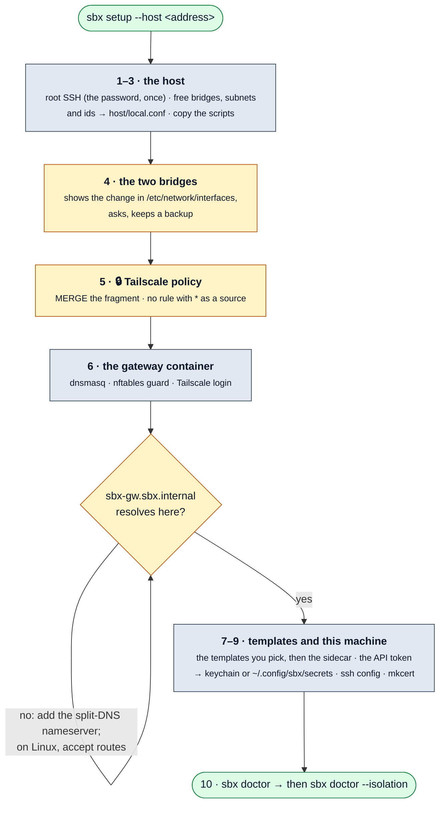

# One-time setup

This document sets up sbx on your own Proxmox host and your own Mac (or Linux
machine). Nothing connects to a different person's host or tailnet.
[getting-started.md](getting-started.md) is the short path through it and on
to a first agent sandbox.

## What you need

- A Proxmox VE 8 or 9 host, with its root password. The host needs a Linux
  bridge on your LAN and a storage for VM disks of a type that can make linked
  clones (LVM-thin, ZFS, or a directory storage with qcow2).
- A Mac with Python 3.11 or later, and the Tailscale app, signed in. A Linux
  machine works too: see [A Linux machine instead of a Mac](#a-linux-machine-instead-of-a-mac).
- A Tailscale tailnet where you are an admin. You change its policy and its DNS.
- Optional: `mkcert` (`brew install mkcert`) for https in each sandbox, and
  `herdr` for the sidebar.
- Optional: 1Password and its CLI `op` (2.20.0 or later), to keep the sandbox SSH key in
  1Password instead of a file ([step 7](#7-your-mac)). Install `op` from
  <https://developer.1password.com/docs/cli/get-started/>, and turn on
  1Password, Settings, Developer, "Integrate with 1Password CLI".

## The fast path: `sbx setup`



`sbx setup` does steps 0 to 7 below in order. It reads your host, proposes
the values of `host/local.conf`, and stops at each manual step in the
Tailscale admin console. A step whose check passes is skipped, so you can run
it again after a failure.

**Run it in a normal Terminal window.** It asks for the root password of the
host one time. An agent has no terminal, so SSH cannot ask for the password.

1. Put `sbx` on your PATH:

   ```
   ln -s "$PWD/bin/sbx" "$(brew --prefix 2>/dev/null || echo /usr/local)/bin/sbx"
   ```

2. Run the setup:

   ```
   sbx setup
   ```

3. Prove the isolation. This makes one sandbox in each profile, and removes them:

   ```
   sbx doctor --isolation
   ```

Run `sbx doctor` at any time. It does the checks of this document, and it
prints the next step for each problem. [troubleshooting.md](troubleshooting.md)
covers the problems that it does not explain.

When the setup is done, read [usage.md](usage.md).

### A second Mac

For a Mac that uses a host that is set up already, run `sbx setup --local-only`.
It copies `host/local.conf` from the host, makes a separate API token for this
Mac, and sets up the Mac. It does not change the host. Each Mac has its own
token, so a new token on one Mac does not stop the others.

### A Linux machine instead of a Mac

sbx runs on Linux too, with the same steps. Five things differ:

- **Tailscale** is the Linux package (`tailscale up`), not the app. Linux
  ignores the routes of a subnet router until you accept them, so run this
  once, before the setup reaches its DNS check:

  ```
  sudo tailscale set --accept-routes
  ```

  Without it, `sbx-gw.sbx.internal` does not resolve, and the setup waits at
  "does not resolve ... on this Mac yet". MagicDNS reaches the system
  resolver through systemd-resolved; `resolvectl query sbx-gw.sbx.internal`
  shows the answer and the link it came from (`tailscale0`).
- **The secrets** are files in `~/.config/sbx/secrets/`, readable by you only,
  because there is no keychain. See
  [the secret store](reference.md#the-secret-store).
- **The routes** of the machine, which the proposed subnets must miss, come
  from `ip -4 route` instead of `netstat`. A Docker network such as
  `172.17.0.0/16` counts.
- **Your git key** for a personal sandbox goes into the agent with a plain
  `ssh-add ~/.ssh/<key>`; `--apple-use-keychain` is macOS only.
- **A sign-in link** (`sbx remote-control`) opens with `xdg-open` on a
  desktop. On a machine with no browser, open the printed link on any
  device, and paste the code back at the prompt.

## The values of your setup

The shared defaults live in `host/defaults.conf`. Your own values live in
`host/local.conf`, which is not in git. `sbx setup` writes it for you;
`host/local.conf.example` shows each value. The host scripts and the Mac tool
read the two files, so the two sides always agree. The most important values:

- `SBX_DOMAIN`: the DNS zone of the sandboxes. The default is `sbx.internal`.
- `SBX_LAN_BRIDGE`: the bridge that carries your LAN. The default is `vmbr0`.
- `SBX_AGENT_NET` and `SBX_PERSONAL_NET`: the two sandbox subnets. They must not
  collide with your LAN or with a network that you visit.
- `SBX_TEMPLATE_VMID_MIN` to `SBX_TEMPLATE_VMID_MAX` (the templates),
  `SBX_GW_CTID`, and `SBX_VMID_MIN` to `SBX_VMID_MAX` (the sandboxes): they must
  not collide with a VM or a container that you have.
- `SBX_GW_STORAGE` and `SBX_VM_STORAGE`: the default is `local-lvm`.

What goes into each template is not a host setting: it is a template
definition. `sbx setup` asks which templates to build. [templates.md](templates.md)
explains them.

The steps below are the manual path. In them, `<pve-host>` is the address of
your host, `<domain>` is `SBX_DOMAIN`, and `<agent-net>` is `SBX_AGENT_NET`.

## Two kinds of access

| Purpose | How often | Access |
|---|---|---|
| Setup: steps 1 to 6 below | one time, and again for a template rebuild | a root shell with your password; NO stored key |
| Daily work: each `sbx` command | each day | a Proxmox API token with a narrow scope (step 6) |

No root key for the host is stored on your Mac. The setup steps ask for the root
password. The daily tool cannot use that access at all: it has a token that can
manage only the sandbox pool and can use only the two sandbox bridges.

**Run each `ssh` and `scp` command of this document in a normal Terminal
window.** They ask for the root password. A command that an agent runs for you
has no terminal, so SSH cannot ask and it stops with `Host key verification
failed` or `Permission denied`.

## 0. Trust the host key

The first SSH connection shows the fingerprint of the host. Compare it before you
accept it. In the Proxmox web UI, open **Shell** on the node and run:

```
ssh-keygen -lf /etc/ssh/ssh_host_ed25519_key.pub
```

Then connect one time from your Mac and accept the same fingerprint:

```
ssh root@<pve-host> pveversion
```

You have many SSH keys. If the host closes the connection with "Too many
authentication failures", add `-o PubkeyAuthentication=no` to each `ssh` and
`scp` command in this document.

## 1. Copy the scripts to the Proxmox host

```
scp -r host gw template templates sbxlib sidecar root@<pve-host>:/root/sbx/
```

## 2. Tailnet policy

Do this before the gateway exists. Tailscale refuses the gateway's tag until the
policy names the tag.

**Caution:** The policy applies to your full tailnet. Read your current policy
first, and merge the new parts into it.

1. Open the Tailscale admin console, then **Access controls**.
2. Merge `tailscale/policy.example.hujson` into the policy.
3. Make sure that no rule has `*` as a source. [security.md](security.md) explains why.

Check: the console saves the policy with no error.

## 3. The bridges

**Caution:** This step changes `/etc/network/interfaces` on the host. The script
shows the change, asks before it applies the change, and keeps a backup.

```
ssh -t root@<pve-host> bash /root/sbx/host/10-bridges.sh
```

Check: `ip link show <agent-bridge>` and `ip link show <personal-bridge>` show the two bridges, and
`cat /sys/class/net/<agent-bridge>/bridge/vlan_filtering` prints `1`: each agent sandbox and its
sidecar get a VLAN of their own on it.

## 4. The gateway

```
ssh -t root@<pve-host> bash /root/sbx/host/20-gw-create.sh
ssh -t root@<pve-host> bash /root/sbx/host/20-gw-create.sh --tailscale
```

The gateway takes its LAN address from DHCP on the LAN bridge (`SBX_LAN_BRIDGE`). If that subnet has no
DHCP server, the first command stops and tells you so. Then write a static
address to `host/local.conf`, for example `SBX_GW_LAN_IP=192.168.1.2/24` and
`SBX_GW_LAN_GW=192.168.1.1`, copy `host/` to the host again, and run the command
again.

The second command prints a login URL. Open it. Then, in the admin console:

1. **Machines**: make sure that `sbx-gw` shows the two routes as approved.
2. **DNS**: turn on MagicDNS if it is off.
3. **DNS**, **Nameservers**, **Add nameserver**, **Custom**: enter `<agent-net>.1`,
   turn on **Restrict to domain**, and enter `<domain>`.

Checks, on your Mac with Tailscale connected:

```
dig +short sbx-gw.<domain>     # must print <agent-net>.1
ping -c1 <agent-net>.1                   # must answer
tailscale ping sbx-gw                    # must end with "via <a LAN address>", NOT "via DERP"
```

When your Mac and the host are on different subnets, Tailscale needs a direct
UDP path between them. If `tailscale ping` reports
`via DERP`, your router blocks that path and all sandbox traffic goes through a
relay on the internet. Permit UDP port 41641 between the two subnets.

## 5. The templates

Build one template for each kind of project that you work on. `templates/`
has the shared definitions (`minimal`, `debian`, `rails`, `go`, `rust`,
`python`), and [templates.md](templates.md) explains how to make your own.
Build `sidecar` too: every agent sandbox needs one. For each one:

```
ssh -t root@<pve-host> bash /root/sbx/host/30-template-build.sh <name>
```

Each build takes 15 to 40 minutes. The VM powers off when the build is good. It
stays up when the build fails or stalls, and the script then prints the end of
the provision log. The next build of that template removes the failed VM. For
more detail:

```
ssh -o PubkeyAuthentication=no -t root@<pve-host> bash /root/sbx/host/vm-diag.sh <vmid>
```

Check: `qm list` shows a VM named `sbx-tpl-<name>-<date>`, and
`qm config <vmid> | grep template` prints `template: 1`.

If your SSH session drops during the build, the VM continues on its own. Run
the script again with `--finish <name>`: it attaches to the VM, waits, seals
it, and converts it.

Every later build is one command on your Mac, once step 7 is done:

```
sbx template rebuild <name>
```

It adds the versions that your projects need (`sbx versions`), copies the
scripts and the definitions to the host, asks for the root password once, and
runs the build. Each build is a new version; a sandbox that exists keeps
running as it was.

## 6. The API token

```
ssh -t root@<pve-host> bash /root/sbx/host/40-api-token.sh
```

The script makes the pool `sbx`, the user `sbx@pve`, four small roles, and the
token. It then prints three things:

1. A `security add-generic-password` command. Run it on your Mac. It puts the
   token in the macOS keychain, so the secret is in no file. Off macOS, skip
   it and run `sbx setup --local-only` (step 7), which stores the token in
   `~/.config/sbx/secrets/`.
2. The `pve_api` and `pve_token_command` lines for `config.toml`.
3. Two ways to verify the self-signed certificate of the host. Choose one.
   Save the CA as `~/.config/sbx/pve-root-ca.crt`, with a `.crt` name: it is a
   public certificate, and some tools treat a `.pem` file as a private key.

Proxmox shows the token secret one time. If you lose it, run the script again
with `--rotate`.

You can skip this step. `sbx setup --local-only` in step 7 makes a token for
each Mac by itself.

Check, in the web UI: **Datacenter**, **Permissions**. The user `sbx@pve` has a
role on `/pool/sbx`, on `/pool/sbx-templates`, on the storage, and on the two sandbox
bridges. It has no role on `/`, on `vmbr0`, or on a different VM.

## 7. Your Mac

```
ln -s "$PWD/bin/sbx" "$(brew --prefix 2>/dev/null || echo /usr/local)/bin/sbx"
sbx setup --local-only
```

`sbx setup --local-only` does not change the host. It does these things:

- It copies `host/local.conf` from the host, so this Mac and the host agree.
- It makes this Mac's own API token (`cli-<Mac name>`) and puts it in the
  macOS keychain, or off macOS in a file that only you can read
  ([the secret store](reference.md#the-secret-store)). It writes `pve_api`, the token command, and the certificate
  check into `~/.config/sbx/config.toml`.
- It asks where the key for the sandboxes lives. None of your own keys is put
  in a sandbox. See [The sandbox key](#the-sandbox-key) below.
- It writes the SSH block for the sandboxes, and asks to add its `Include`
  line to `~/.ssh/config`.
- It asks to run `mkcert -install`. Without the mkcert CA, a sandbox serves
  `http://` only.
- It runs `sbx doctor`.

For `agent` sandboxes that clone a private repository, run
`sbx git-token <checkout or git URL>` for each project. [projects.md](projects.md),
"One git token per project", has the steps.

Check: `sbx doctor` reports no failure.

### The sandbox key

Every sandbox and sidecar trusts one key pair that is for the sandboxes only.
`sbx setup` (with or without `--local-only`) asks each time:

> Keep the sandbox SSH key in 1Password and use its SSH agent, instead of a key
> file on this machine?

**No** (the default for a new setup). The key is a file pair,
`~/.config/sbx/id_ed25519` and `.pub`, with no passphrase. The setup makes it
when neither file exists. If only the `.pub` exists, the key lives in
1Password, and the setup stops: a new key would lock you out of the sandboxes
that exist. Export the key from 1Password to the `ssh_key` path, or answer yes.

**Yes.** The private key stays in 1Password, and ssh reaches it through the
1Password SSH agent. Only the `.pub` is on disk. Before the question, turn on
1Password, Settings, Developer, "Use the SSH agent". The setup then:

1. Asks for the agent socket. The default is
   `~/Library/Group Containers/2BUA8C4S2C.com.1password/t/agent.sock` on macOS
   and `~/.1password/agent.sock` on Linux. It waits if the socket is missing.
2. Looks for the key. In this order, it stops at the first match:
   - The `.pub` is on disk, and `ssh-add -L` on that socket lists it.
   - A 1Password item titled `sbx` exists. The setup reads its public key
     with `op` and creates nothing.
   - Otherwise there is no key in 1Password yet. See below.
3. Saves `ssh_agent` in `config.toml` ([reference.md](reference.md#mac-settings-configsbxconfigtoml)).
4. Offers to remove the private key file (the default is no), once the agent
   lists its public key.

When there is no key in 1Password yet:

| You have | The setup |
|---|---|
| `~/.config/sbx/id_ed25519` already | asks: **[i]mport** or **[n]ew**. Import: `op` cannot import an existing private key, so the setup tells you to do it in the 1Password app: New Item, SSH Key, Add Private Key, Import. Title the item `sbx`. Your current sandboxes keep working. New: the setup makes a new key with `op`. Your current sandboxes keep trusting the OLD key until you rebuild them. |
| no key file | makes the key with `op item create --category "SSH Key" --title sbx --ssh-generate-key ed25519`, and reads the public key back. The private key is not printed or stored by sbx. |

`op` problems:

- **`op` is not installed.** The setup says so and prints the install link. It
  offers to let you make the `sbx` item in the 1Password app instead, and then
  you pick the key from the list that the agent shows.
- **`op` is older than 2.20.0.** An older `op` has no SSH Key items (`Unknown
  item category SSH Key`), so the setup stops and asks you to update it:
  `op update`, `brew upgrade --cask 1password-cli`, or the install link.
- **`op` is not signed in.** Turn on 1Password, Settings, Developer,
  "Integrate with 1Password CLI", or run `op signin`.

The 1Password SSH agent serves only the Private (or Personal) vault by
default. If the key is in another vault, list the item in
`~/.config/1Password/ssh/agent.toml`. If the agent does not list the key, the
setup pauses and says so.

With `ssh_agent` set, sbx runs `ssh` with `IdentityAgent=<socket>` and
`IdentityFile=<ssh_key>.pub`, and the `Host sbx-*` block has both lines too.
1Password asks you to approve a use of the key. [architecture.md](architecture.md#ssh)
explains why the options are explicit. `sbx doctor` checks the socket, the
`.pub`, and that the agent lists the key, and it warns when the private file
is still on disk.

Check: `ssh-add -L` on the socket lists the `sbx` key.

## 8. The first sandbox

This is the controlled pair that proves the isolation. Run the same command in
each profile.

```
sbx new probe-a --profile agent
sbx new probe-p --profile personal

sbx ssh probe-a -- curl -sS -m5 -o /dev/null -w '%{http_code}\n' https://example.com     # 200
sbx ssh probe-a -- curl -sS -m5 http://<an-address-on-your-LAN>                          # must FAIL
sbx ssh probe-p -- curl -sS -m5 http://<an-address-on-your-LAN>                          # must pass
sbx ssh probe-a -- ping -c1 -W2 <the-tailscale-address-of-your-Mac>                     # must FAIL
sbx ssh probe-p -- ping -c1 -W2 <the-tailscale-address-of-your-Mac>                     # must FAIL
```

If the `agent` probe to your LAN fails and the `personal` probe passes, the
guard works. If the two fail, the network is broken and the test proves nothing.

A warning `does not resolve on this Mac` during `sbx new` means the sandbox's
name was late and the tool fell back to the address. The sandbox works, but
look at [troubleshooting.md](troubleshooting.md), "Names and the network".

Then check the port mirror:

```
sbx ssh probe-a -- 'cd /tmp && nohup python3 -m http.server 4400 --bind 127.0.0.1 >/dev/null 2>&1 &'
curl -sS https://sbx-probe-a.<domain>:4400/ | head -3
sbx rm probe-a -y && sbx rm probe-p -y
```

## Appendix: a GPU

No script sets up this part, and nothing here is tested. Do the steps above
first; each sandbox works without a GPU.

There are three levels. Use the lowest level that does the job.

1. **Software Vulkan. This is the default, and it needs no setup.**
   - Each sandbox has the Mesa software driver.
   - It is sufficient for a headless run of a wgpu application. It is slow, so
     it is not valid for a frame-time measurement.
2. **Shared Vulkan through virtio-gpu (Venus). Experimental.**
   - The card stays with the host and its driver. Many sandboxes share it.
   - An AMD card with the Mesa driver on the host is the pair that Venus supports
     best.
   - It gives a guest no hardware video encoder, so it does not serve a game stream.
   - It needs custom QEMU arguments, which only `root` can set. They belong in the
     template, and each clone gets them.
3. **Passthrough with `sbx new --gpu` or `sbx gpu attach`. One sandbox at a time.**
   - This is the level that a game stream needs.
   - The host console is dark while a VM holds the only GPU. Keep a recovery path.
   - Pass all the functions of the card, for example the display function and
     its HDMI audio function.
   - Some cards do not reset after a VM stops, and the next VM that uses the
     card fails to start until the host restarts. Some AMD cards have this
     fault; the `vendor-reset` kernel module corrects it for many of them.
     Check that the module builds on your host kernel before you rely on it.
   - A token cannot name a raw PCI address; only `root` can. Define a PCI
     **Resource Mapping** one time (**Datacenter**, **Resource Mappings**). Then
     set `SBX_GPU_MAPPING` in `host/local.conf`, copy `host/` to the host, and
     run `40-api-token.sh --acl-only` again.
