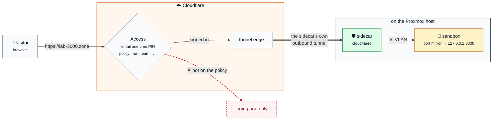

# Daily use

This document is for a user with a working setup. To set up sbx, read
[setup.md](setup.md). For every option of every command, read
[reference.md](reference.md).

## Choose a profile

A sandbox has a profile. The profile answers one question: **who runs
inside?** An AI agent with full permissions, or you.

| | `agent` | `personal` |
|---|---|---|
| Network | Its sidecar, and the internet through it. No LAN, no tailnet, no other sandbox, not even the gateway. | The internet, the LAN, and the sidecars. No tailnet. |
| Sidecar | A small trusted VM on the sandbox's own VLAN: it holds the credentials and the port policy, and it is the sandbox's only neighbour. | None. |
| Git access | A token for one project, held by the sidecar. The VM presents a placeholder. Without a token, public repositories only. | Your SSH agent, forwarded for the git clones only. |
| Secrets | Each input of the project needs `--with` or `--without`. Nothing goes in by default. | Each input that sbx finds goes in, and sbx prints the list. |
| Snapshot | A `clean` snapshot after the recipe. | None by default. |
| Claude Remote Control | Only with `sbx remote-control <name> --allow-agent`. | Yes, so claude.ai/code and the Claude phone app can drive the sandbox. |
| Expiry | Three days by default. | None. |

The two profiles share everything else: the templates, the tools, the names,
the certificate, and the ports. [security.md](security.md) shows what an agent
sandbox can reach, and how the profiles are enforced.

The default profile is `agent`. To change it, set `default_profile` in
`~/.config/sbx/config.toml`.

## Make a sandbox

```
sbx new lab                                   a plain sandbox
sbx new lab --profile personal                a sandbox for your own work
sbx new app --project ~/code/app              clone the project and run its recipe
sbx new app --project ~/code/app --with rails-master-key --without STRIPE_SECRET_KEY
```

- A plain sandbox is ready in a few minutes: an agent sandbox's sidecar comes
  up first. A project adds its recipe.
- `<name>` is one DNS label: lowercase letters, digits and hyphens. The VM's
  host name is `sbx-<name>`.
- `--project` takes a checkout path, a git URL, or a name that `sbx projects`
  lists. The sandbox clones the PUSHED state of the branch; `--branch` picks
  another. sbx warns when you have local commits that are not pushed. A
  private repository needs no checkout on your machine: `sbx git-token <URL>`,
  then `--project <URL>` ([projects.md](projects.md)).
- An `agent` sandbox of a project needs a decision for each input. Run
  `sbx inputs <project>` first: it lists the inputs and makes nothing.
- `--cores`, `--memory` and `--disk` change the size. `--ttl DAYS` changes the
  expiry, and `--ttl 0` means no expiry.

sbx checks everything that can fail before it makes a VM: the name, the
project, each input, the git access, the SSH key, and a free VM ID. A mistake
therefore costs no VM.

[projects.md](projects.md) explains how a project declares its recipe and its
inputs.

## Reach a sandbox

**Shell.** Each of these works:

```
sbx ssh lab
sbx ssh lab -- uname -a
ssh sbx-lab
```

`ssh sbx-<name>` needs the `Include` line in `~/.ssh/config`, which
`sbx setup` offers to add.

An agent sandbox's name is its sidecar, which passes port 22 to the VM. The
sidecar itself answers on port 2222: `sbx ssh <name> --sidecar`. Its log is
`sudo journalctl -u sbx-sidecar` there.

**Ports in "ask" mode.** With `sidecar_ports = "ask"` in `config.toml`, an
agent sandbox's ports stay closed until you approve one. The sandbox asks its
sidecar (`POST http://<sidecar_link>.1:8081/expose` with `{"port": 3000}` and
its placeholder); you answer from your machine:

```
curl http://sbx-lab.sbx.internal:8081/requests
curl -d '{"port": 3000}' http://sbx-lab.sbx.internal:8081/approve     (or /deny)
```

An approval lasts until a denial, across reboots. sbx has no command for it
yet. The default, `open`, forwards every port from 1024 to 32767.

**Names.** Each sandbox has the name `sbx-<name>.<domain>`, for example
`sbx-lab.sbx.internal`. The name exists as soon as the sandbox boots. Nothing
is written when you make or remove a sandbox.

**Ports.** Every port of a sandbox is direct, with the same number. A dev
server on `127.0.0.1:3000` in the sandbox is reachable from your Mac at:

```
https://sbx-lab.sbx.internal:3000
```

- A server needs no bind option. Keep its default `127.0.0.1`.
- A server that answers HTTP gets `https://` with a certificate that your Mac
  trusts. A plain `http://` request on that port redirects to `https://`.
- Any other port (a database, a debugger) is forwarded as raw TCP.
- A server that binds every interface (`0.0.0.0`) is reachable already, but
  gets no TLS. Docker publishes that way, so a database container is plain
  TCP on its port.
- Two sandboxes can use the same port, because each has its own address.

HTTPS needs the mkcert CA on your Mac. Without it, a sandbox serves `http://`
only. `sbx doctor` checks it.

### Previews

`sbx publish` puts a port of an agent sandbox at a public hostname, behind
Cloudflare Access: only the people that its policy names get past a sign-in.
It is for previews, not for a public site.



```
sbx publish lab 3000                   https://lab-3000.<preview_zone>, for you
sbx publish lab 3000 --policy team     for the people of [policy.team]
sbx publish lab 3000 --host demo       https://demo.<preview_zone>
sbx publish lab                        what lab publishes
sbx publish lab 3000 --off             withdraw it
```

The tunnel reaches the port as your Mac does, through the port mirror: a
server on `127.0.0.1` needs nothing. When the sandbox has a certificate, the
tunnel speaks https to it; a server of its own on `0.0.0.0` with no TLS needs
`--plain`. `sbx rm` withdraws a sandbox's previews; `sbx gc` withdraws the
ones whose sandbox is gone. A preview survives a reboot of the sidecar, but
the app in the sandbox must run for it to answer.

A preview arrives with its public hostname, which Rails and Vite do not know.
Start the server with it allowed, for example
`RAILS_DEVELOPMENT_HOSTS=".sbx.internal,.<preview_zone>" bin/dev`, and
`__VITE_ADDITIONAL_SERVER_ALLOWED_HOSTS=.<preview_zone>` for Vite.

Set it up once:

1. In the Cloudflare dashboard, two things that no API token can do:
   - **a domain of its own** for the previews, on the account and active (not
     your main domain: an agent serves what it wants there);
   - **Cloudflare One (Zero Trust)** turned on: a team name, and a plan (Free
     will do).
2. An API token. `sbx cloudflare-setup --token-guide` shows the permissions:
   one token for sbx, or one that may change who signs in and nothing else.
3. With the token in `CLOUDFLARE_API_TOKEN` (or `--stdin`; never an argument):

   ```
   sbx cloudflare-setup --account-id <id> --zone previews.example.com --email you@example.com
   ```

   It checks the token, the domain and Zero Trust; adds the One-time PIN
   login method if it is missing; makes the policy `sbx: me` and the wildcard
   Access application; stores the token; and writes `preview_zone`,
   `cloudflare_account_id` and `[policy.me]`. A second run changes only the
   emails. `--dry-run` shows what it would do. With `--access-only`, it
   updates who may sign in and stores no token.

More policies go into `~/.config/sbx/previews.toml` by hand:

```
[policy.me]
emails = ["you@example.com"]

[policy.team]
emails = ["a@example.com"]
email_domains = ["example.org"]
```

The first `sbx publish` makes one Access application for every hostname of
the domain, with the policy `me`, before it makes any name. A hostname with
another policy gets an application of its own. A policy names emails and
email domains only: sbx has no way to publish past a sign-in.

Policies that you add to the wildcard application in the dashboard stay: sbx
only makes sure `sbx: me` is among them.

**A server that machines must reach** (an MCP server that Claude calls, OAuth
endpoints) cannot sign in to Access. Let those paths alone through, by hand:
in Zero Trust, a self-hosted application for the same hostname with only
those paths (for example `mcp`, `.well-known/oauth-protected-resource*`,
`.well-known/oauth-authorization-server*`, `oauth/token`), and a policy with
Action **Bypass**, Include **Everyone**. The more specific application wins
for its paths; the rest of the hostname stays behind the sign-in. The app on
those paths is then public, so it must check its own tokens, and the agent in
the sandbox writes that code. `sbx publish --off` and `sbx rm` remove such an
application with the hostname, so a bypass never outlives its preview.
[security.md](security.md) explains the tunnel and its token.

## Work in a sandbox

- The user is `dev`, with sudo and no password.
- A project is in `~/code/<project>`.
- The recipe's output is in `~/.local/state/sbx/recipe.log`.
- Every template has Node (nvm), Docker with compose, Caddy, Chrome (through
  `agent-browser`), Claude Code and herdr. It also has the components of its
  definition: Ruby, Go, Rust, Python, and so on. `cat /etc/sbx/template` in
  the sandbox shows which.
- Rails and Vite accept the sandbox's name as a `Host` header with no change
  in the project. A preview's hostname needs the step in
  [Previews](#previews).
- A template may have mise (the `debian` template does): a project's
  `.tool-versions` or `mise.toml` picks its versions, and `mise install`
  fetches them.

### herdr

When herdr is installed on your Mac, `sbx new` adds each sandbox to the herdr
sidebar, and `sbx rm` removes it.

```
sbx herdr lab             add the sandbox to the sidebar again
sbx herdr lab --attach    open one full herdr window on this sandbox
sbx layout lab            build the project's panes again (.sandbox/herdr.toml)
```

`--no-herdr` on `sbx new` skips the sidebar.

## Claude Code

Claude Code in each sandbox signs in to your Claude subscription (Pro or Max),
not to an API key.

1. Run `sbx claude-token` one time. It runs `claude setup-token` on your Mac,
   which opens the browser. Paste the token that it prints at the hidden
   prompt. The token is valid for one year.
2. Each new sandbox gets the token. An agent sandbox's sidecar holds it, and
   the sandbox gets a placeholder and the sidecar's address
   (`sidecar_claude = "proxy"`, the default). `--no-claude` on `sbx new` skips
   it.
3. From 30 days before the expiry, `sbx new` and `sbx list` print a warning.
   Run `sbx claude-token` again. It writes the new token into each running
   sandbox that has one.

```
sbx claude-token --status        is a token stored, and when does it expire
sbx claude-token --push <name>   write the stored token into a sandbox that has none
sbx claude-token --remove        forget the token, and delete it from each sandbox
```

**Warning:** a personal sandbox holds the token itself, and so does an agent
sandbox with `sidecar_claude = "direct"`: its agent can read it. Use a token
that you can revoke in your claude.ai account settings.

### Remote Control

`claude remote-control` lets claude.ai/code and the Claude phone app drive a
sandbox. It needs a full claude.ai sign-in, one time per sandbox.

1. `sbx new` starts the sign-in at its end for a personal sandbox, when a
   terminal is present. Later, run `sbx remote-control <name>`.
2. sbx opens the sign-in URL on your Mac. Click **Authorize**, then paste the
   code that the page shows.
3. The server runs as a service in the sandbox and restarts by itself.

```
sbx remote-control <name> --status   the server's state
sbx remote-control <name> --off      stop the server
sbx remote-control <name> --mode bypassPermissions   the permission mode of its sessions
```

`--no-remote-control` on `sbx new` skips it; `--remote-control-mode` sets
the mode.

An agent sandbox gets Remote Control only when you ask for it, one sandbox at
a time: `sbx remote-control <name> --allow-agent`. The full sign-in can make
API keys on your organization, and the agent in that sandbox can read it; the
command warns each time. `sbx new` never does it for an agent sandbox. The
sessions of Remote Control talk to Anthropic with that sign-in; a `claude` in
a terminal of the sandbox keeps the sidecar's proxy.

## After a host reboot

A sandbox does not start with the host unless you mark it:

```
sbx autostart lab            start at boot, and resume its Claude Code sessions
sbx autostart lab --status   what it would resume
sbx autostart lab --off
```

Marking changes the VMs' configuration and installs two small programs in
the sandbox; nothing running is restarted. At the next boot the gateway
starts first, then the sandbox and its sidecar, and every Claude Code
session that was running in it comes back with `claude --resume`: on Remote
Control when the sandbox has the full claude.ai login, else in a terminal. A
session that you ended is not resumed. The resumed sessions run in their own
tmux server: `sbx ssh lab`, then `tmux -L sbx-resume ls`.
[architecture.md](architecture.md#claude-code) shows the boot, step by step.

## Snapshots

```
sbx snap lab             take a snapshot named "clean"
sbx snap lab before-upgrade
sbx snap lab before-upgrade --ram   with the memory: a rollback resumes it as it was
sbx rollback lab         return to "clean"
sbx rollback lab before-upgrade
```

A snapshot covers the sandbox and its sidecar, with the same label, and
neither stops for it.

An agent sandbox gets a `clean` snapshot, of it and its sidecar, after its
recipe, so a rollback returns it to a sandbox that is ready for work. A
sandbox made before sidecars were in `clean` rolls back alone, with a
warning; its sidecar keeps its state.

**Caution:** a snapshot contains the secrets that are on the disk.
`sbx rm` destroys the snapshots with the VM.

## Remove sandboxes

```
sbx list          every sandbox, with its profile, template, project, expiry and start at boot
sbx rm lab        destroy one sandbox, its sidecar and their snapshots, and withdraw its previews
sbx gc            destroy each expired sandbox, and a sidecar or a preview tunnel whose
                  sandbox is gone (it asks first)
sbx extend lab --days 7    seven more days
sbx extend lab --never     no expiry
```

- The expiry is a soft limit. Nothing destroys a sandbox by itself. `sbx list`
  marks an expired sandbox, and `sbx gc` destroys it.
- A removed sandbox's name stays in DNS for up to one hour. A new sandbox with
  the same name takes the name at once.

## The portal

The portal is a web page for everything that sbx does. It runs on your Mac
only.

```
sbx web                  start the portal, and open it in the browser
sbx web --no-open        print the link only
```

Keep the terminal window open while you use the portal. Ctrl-C stops it.

The portal has these pages:

| Page | What you do there |
|---|---|
| Overview | See the sandboxes, the templates, the Claude token and the checks of this Mac. |
| Sandboxes | Make, start, stop, snapshot and destroy sandboxes. Each sandbox has tabs for its facts and charts, its listening ports, its system, its logs, its snapshots, its Remote Control, its Proxmox configuration and its Proxmox tasks. |
| Templates | See each template and its versions. Edit a local definition, export or import a template, and see the components. |
| Projects | See each project's recipe, inputs, bindings and sandboxes. Store or remove its git token, and install it into a sandbox that runs already. |
| Tokens | Store, send or remove the Claude token. See the git token of each project. |
| Checks | Run the checks of `sbx doctor`, and the isolation test. |
| Activity | See each change that the portal made, with the full output. |
| Settings | Change the Mac settings in `config.toml`. See the host settings. |
| Docs | Read these documents. |

The portal runs the same `sbx` commands that you type. A command that needs
the host's root password or a sign-in in the browser opens in Terminal. For
example, `sbx template rebuild` and `sbx setup` open in Terminal. You type the
password there, not in the portal.

A token that you paste into the portal goes to `sbx` over stdin, and then into
the keychain. The portal never shows a token.

[architecture.md](architecture.md#the-portal) explains how the portal keeps
other web pages out.

## Projects

sbx records each project that a command sees. `--project <name>` then works by
name.

```
sbx projects                   the projects, their git tokens and their sandboxes
sbx project add ~/code/app     record a checkout
sbx project rm app             forget a project
sbx inputs app                 what the recipe asks for, and where each value comes from
sbx git-token app              store a git token for the project's agent sandboxes
sbx git-token app --push lab   ... and install it into a sandbox that runs already
```

[projects.md](projects.md) explains recipes, inputs and git tokens.

## Templates

Each sandbox is a clone of one template. You can have one template for each
kind of project: `rails`, `rust`, your own.

```
sbx new lab --template rust     a sandbox from a named template
sbx template list               the definitions, and which are built and current
sbx template rebuild rust       build a new version (15 to 40 minutes)
sbx template new web --from rails   start your own definition
```

A project can name its template in `.sandbox/sandbox.toml`
(`[recipe] template = "rails"`). Without a name, `sbx new` uses
`default_template` from `config.toml`.

A rebuild makes a new version. A sandbox is a full copy of its template and
does not need it afterwards, so a rebuild never touches a sandbox. [templates.md](templates.md)
explains templates in full.

## The GPU

A sandbox has software Vulkan, which needs no setup. For the real GPU, set up
a PCI Resource Mapping first (the GPU appendix of [setup.md](setup.md)). Then:

```
sbx new game --gpu        give the GPU to a new sandbox
sbx gpu status            which sandbox holds the GPU
sbx gpu attach <name>     move the GPU to a sandbox (it restarts)
sbx gpu detach <name>     take the GPU back (the sandbox restarts)
```

One sandbox at a time can hold the GPU.
