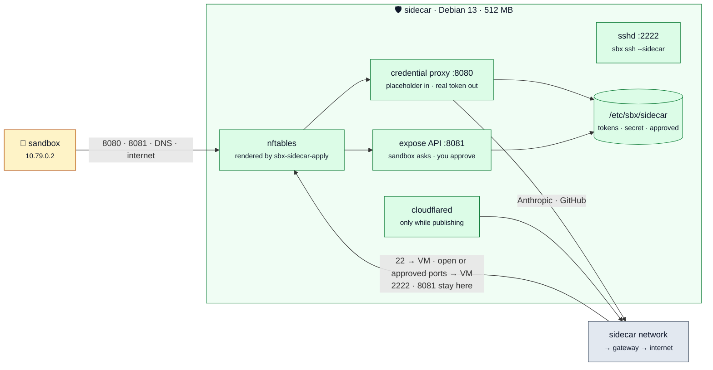

# The sidecar

One trusted VM per agent sandbox. The sandbox VM has exactly one network link,
a VLAN that only it and its sidecar share, and the sidecar decides what
crosses it. The sidecars share a network with the gateway; the agents share
nothing.

`sbx new` clones a sidecar beside each agent sandbox and writes its policy.
This directory holds what runs inside a sidecar; `template/components/sidecar.sh`
installs it into the `sidecar` template (`templates/sidecar.toml`).
[docs/security.md](../docs/security.md) has the trust model,
[docs/architecture.md](../docs/architecture.md) the mechanism.

The sidecar is a bare Debian 13 VM (`templates/sidecar.toml`: 1 core,
512 MB, a 4 GB disk; about 100 MB of memory in use).

## What is here

| File | Installed as | What |
|---|---|---|
| `nftables.conf.tmpl` | `/usr/local/lib/sbx/sidecar-nftables.tmpl` | the sidecar's boundary. From the sandbox: the two services, a ping, DNS to the gateway, the internet. From the shared network: the gateway side only. Port 22 and the open or approved ports are translated to the VM. |
| `sidecar.py` | `/usr/local/lib/sbx/sidecar.py` | the credential proxy (`<wire>:8080`): the sandbox's placeholder in, the real Claude or git token out. A refusal is a 401 that names Basic auth, so git sends its stored placeholder. The expose API (`8081`): the sandbox asks, only the net side approves, an approval adds the port to the nftables set `approved` and to `/etc/sbx/sidecar/approved`, which the service opens again when it starts. |
| `sbx-sidecar-apply` | `/usr/local/bin/sbx-sidecar-apply` | renders the firewall from `/etc/sbx/sidecar.env`, registers the sandbox's name in DHCP, starts the service. `--claude-token` replaces the Claude token from stdin; `--tunnel-token` writes the preview tunnel's connector token (empty: stop the tunnel). |
| `sbx-sidecar.service` | systemd | runs `sidecar.py` with the addresses that apply wrote |
| `sbx-sidecar-apply.service` | systemd | runs apply after cloud-init on each boot, because cloud-init sets the VM's own name back |
| `sbx-cloudflared.service` | systemd | runs `cloudflared` for `sbx publish`, while `/etc/sbx/sidecar/cloudflared.env` exists |

The sidecar's own sshd is on port 2222 (`sbx ssh <name> --sidecar`).

## What the tests prove

- `tests/test_sidecar.py`: the handlers, with in-memory sockets and a fake
  upstream. The real token goes upstream in the right header (a bearer with
  the OAuth beta header, or `x-api-key` for a Console key; basic auth for
  git). A wrong placeholder, no placeholder, or a bad basic-auth password is
  refused before any upstream call, with a 401 that names Basic auth. Only
  the net side opens a port, and a refused firewall change is an error, not
  an approval. An approval survives a restart; the approved-ports file is
  re-checked when it is read.
- `tests/test_host_scripts.py`: `sbx-sidecar-apply` with stub commands:
  the rendered firewall, the name, the Claude and tunnel tokens.
- `tests/run-sidecar-test.sh` (Docker): two agents, two sidecars, the gateway
  with its real rules, a LAN host that is also the "internet", and a tailnet
  device, on a VLAN-aware bridge. An agent reaches its sidecar and the
  internet and nothing else, not even the other agent when it tries the
  bridge directly. Port 22 of the sidecar's address reaches the sandbox from
  the tailnet and from nowhere else. A port opens only after an approval and
  closes on a denial, and stays open across a restart of the service after
  the firewall is rendered afresh. In "open" mode the sidecar keeps its own
  2222 and 8081. git's way of sending a credential (only after a 401 that
  names a scheme) works. Every refusal has a control.

## Limits

- **The Claude lane buffers too.** Claude Code documents the base-URL path
  for a Console API key. The proxy sends a subscription token as a bearer
  with the OAuth beta header, which is what Claude Code itself sends; the
  real API accepted it on 2026-09-26, so `proxy` is the default. A streamed
  answer arrives whole, when it is complete.
- **Uploads are buffered.** The proxy reads a request and a response whole
  before it forwards them. A `git push` with a chunked body does not work
  through it; a clone does.
- **The forwarded ports are plain TCP** to the VM, which does its own TLS
  through the mirror, as before. The leaf key therefore still lives in the VM.
- **A sidecar's code comes from its template.** A fix under `sidecar/` reaches
  a new sandbox after `sbx template rebuild sidecar`; a running sidecar keeps
  the code it was cloned with.
- **A new git token reaches a running sidecar only when pushed:**
  `sbx git-token <project> --push <name>`. Otherwise a sidecar keeps the
  token it got from `sbx new`.
